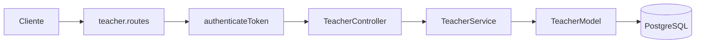

# Design: Dashboard docente

## Contexto

El proyecto actual es un microservicio Express 5 con TypeScript, PostgreSQL y arquitectura por capas:

```text
routes -> controllers -> services -> models -> database
```

El nuevo dashboard docente debe seguir la misma estructura para mantener cohesion y reducir cambios transversales.

## Componentes propuestos



## Archivos

### `src/routes/teacher.routes.ts`

Responsabilidades:

- Definir `GET /me/dashboard`.
- Aplicar `authenticateToken`.
- Documentar el endpoint con OpenAPI.
- Delegar al controlador.

### `src/controllers/teacher.controller.ts`

Responsabilidades:

- Leer `req.user` inyectado por `authenticateToken`.
- Validar existencia de `user.id`.
- Validar rol docente normalizando mayusculas/minusculas.
- Invocar `TeacherService.getDashboard(user.id)`.
- Traducir errores esperados a HTTP.

### `src/services/teacher.service.ts`

Responsabilidades:

- Orquestar la obtencion del dashboard.
- Ejecutar lecturas independientes con `Promise.all`.
- Normalizar valores nulos a `0` o arreglos vacios.
- Mantener reglas de negocio fuera del controlador.

### `src/models/teacher.model.ts`

Responsabilidades:

- Ejecutar SQL parametrizado.
- Concentrar dependencias del esquema relacional.
- Devolver datos crudos con nombres faciles de mapear.

## Contrato TypeScript sugerido

```ts
export interface TeacherDashboard {
  summary: TeacherDashboardSummary;
  assignments: TeacherAssignment[];
  courses: TeacherCourseStats[];
}

export interface TeacherDashboardSummary {
  totalStudents: number;
  pendingEvaluations: number;
  todayAttendances: number;
  monthlyAnnotations: number;
}

export interface TeacherAssignment {
  cadId: number;
  courseId: number;
  courseName: string;
  subjectId: number;
  subjectName: string;
  subjectCode: string | null;
  roomIds: number[];
}

export interface TeacherCourseStats {
  courseId: number;
  courseName: string;
  attendanceCount: number;
  generalAverage: number;
}
```

## Estrategia SQL

Usar una consulta por seccion para mantener claridad y evitar joins gigantes dificiles de auditar:

1. `getDashboardSummary(docenteId)`
2. `getTeacherAssignments(docenteId)`
3. `getCourseStats(docenteId)`

Estas tres consultas pueden ejecutarse con `Promise.all` desde el servicio porque son lecturas independientes.

## SQL de referencia alineado al esquema real

### Summary

```sql
WITH teacher_cad AS (
  SELECT id, curso_id, asignatura_id
  FROM curso_asignatura_docente
  WHERE docente_id = $1
),
teacher_courses AS (
  SELECT DISTINCT curso_id
  FROM teacher_cad
)
SELECT
  (
    SELECT COUNT(DISTINCT e.estudiante_id)
    FROM estudiantes e
    JOIN teacher_courses tc ON tc.curso_id = e.curso_id
  )::int AS total_students,
  (
    SELECT COUNT(DISTINCT ev.evaluacion_id)
    FROM evaluaciones ev
    JOIN teacher_cad tcad ON tcad.id = ev.cad_id
    WHERE ev.fecha_evaluacion >= CURRENT_DATE
  )::int AS pending_evaluations,
  (
    SELECT COUNT(DISTINCT a.asistencia_id)
    FROM asistencia a
    JOIN teacher_cad tcad ON tcad.id = a.cad_id
    WHERE a.fecha = CURRENT_DATE
  )::int AS today_attendances,
  (
    SELECT COUNT(DISTINCT an.anotacion_id)
    FROM anotaciones an
    WHERE an.docente_id = $1
      AND an.fecha_registro >= date_trunc('month', CURRENT_DATE)
      AND an.fecha_registro < date_trunc('month', CURRENT_DATE) + INTERVAL '1 month'
  )::int AS monthly_annotations;
```

### Assignments

```sql
SELECT
  cad.id AS cad_id,
  c.curso_id AS course_id,
  CONCAT(c.nivel, ' ', c.letra) AS course_name,
  asig.asignatura_id AS subject_id,
  asig.nombre AS subject_name,
  asig.siglas AS subject_code,
  COALESCE(
    ARRAY_REMOVE(ARRAY_AGG(DISTINCT sea.sala_id), NULL),
    ARRAY[]::integer[]
  ) AS room_ids
FROM curso_asignatura_docente cad
JOIN cursos c ON c.curso_id = cad.curso_id
JOIN asignaturas asig ON asig.asignatura_id = cad.asignatura_id
LEFT JOIN evaluaciones ev ON ev.cad_id = cad.id
LEFT JOIN asistencia a ON a.cad_id = cad.id
LEFT JOIN sala_evaluacione_asistencia sea
  ON sea.evaluacion_id = ev.evaluacion_id
  OR sea.asistencia_id = a.asistencia_id
WHERE cad.docente_id = $1
GROUP BY
  cad.id,
  c.curso_id,
  c.nivel,
  c.letra,
  asig.asignatura_id,
  asig.nombre,
  asig.siglas
ORDER BY course_name, subject_name;
```

### Course stats

```sql
WITH teacher_cad AS (
  SELECT id, curso_id
  FROM curso_asignatura_docente
  WHERE docente_id = $1
),
teacher_courses AS (
  SELECT DISTINCT curso_id
  FROM teacher_cad
),
attendance_by_course AS (
  SELECT
    tcad.curso_id,
    COUNT(DISTINCT a.asistencia_id)::int AS attendance_count
  FROM teacher_cad tcad
  JOIN asistencia a ON a.cad_id = tcad.id
  GROUP BY tcad.curso_id
),
average_by_course AS (
  SELECT
    tcad.curso_id,
    ROUND(AVG(n.valor)::numeric, 2) AS general_average
  FROM teacher_cad tcad
  JOIN evaluaciones ev ON ev.cad_id = tcad.id
  JOIN notas n ON n.evaluacion_id = ev.evaluacion_id
  GROUP BY tcad.curso_id
)
SELECT
  c.curso_id AS course_id,
  CONCAT(c.nivel, ' ', c.letra) AS course_name,
  COALESCE(abc.attendance_count, 0)::int AS attendance_count,
  COALESCE(avgc.general_average, 0)::float AS general_average
FROM teacher_courses tc
JOIN cursos c ON c.curso_id = tc.curso_id
LEFT JOIN attendance_by_course abc ON abc.curso_id = c.curso_id
LEFT JOIN average_by_course avgc ON avgc.curso_id = c.curso_id
ORDER BY course_name;
```

## Pseudocodigo de servicio

```ts
export class TeacherService {
  static async getDashboard(teacherId: number): Promise<TeacherDashboard> {
    const [summary, assignments, courses] = await Promise.all([
      TeacherModel.getDashboardSummary(teacherId),
      TeacherModel.getTeacherAssignments(teacherId),
      TeacherModel.getCourseStats(teacherId),
    ]);

    return {
      summary: {
        totalStudents: summary?.totalStudents ?? 0,
        pendingEvaluations: summary?.pendingEvaluations ?? 0,
        todayAttendances: summary?.todayAttendances ?? 0,
        monthlyAnnotations: summary?.monthlyAnnotations ?? 0,
      },
      assignments,
      courses,
    };
  }
}
```

## Tests sugeridos

- Mockear `TeacherModel` en tests unitarios del servicio para validar normalizacion.
- Mockear `authenticateToken` o firmar JWT real en tests de integracion HTTP.
- Validar que el controlador no acepte `docente_id` por query string.
- Validar que un usuario con rol `Estudiante` o `Administrador` recibe `403`.
- Validar que `roomIds` sea arreglo vacio si la asignacion no tiene sala por evaluacion/asistencia.

## Riesgos y decisiones

- El microservicio se llama `ms_authentication`, pero el dashboard docente pertenece al dominio academico. Si existe o se planea un microservicio academico, este endpoint deberia vivir ahi. Si por ahora este servicio concentra perfil y datos del usuario, esta implementacion es aceptable como paso incremental.
- La tabla `salas` no contiene nombre ni capacidad; por eso el contrato retorna `roomIds` y no `roomName`.
- La tabla puente se llama `sala_evaluacione_asistencia`. Aunque el nombre parece tener un typo, el spec debe respetar el esquema existente.
- `evaluaciones` no tiene `estado`; este spec define pendiente por `fecha_evaluacion >= CURRENT_DATE`.
- Las fechas del seed son de 2024. En ejecuciones actuales, las metricas de hoy y evaluaciones pendientes pueden ser `0` sin que eso implique un bug.

