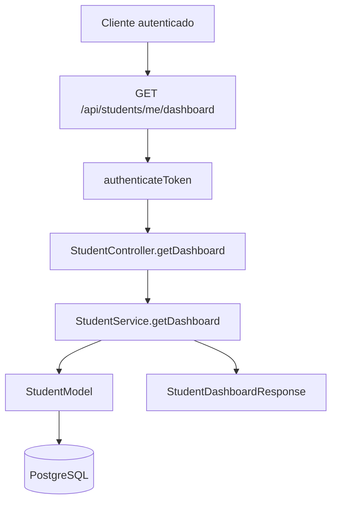

# Design: Dashboard de Estudiante

## Contexto
El proyecto es un backend Express con TypeScript, PostgreSQL via `pg`, autenticacion JWT y Swagger. Ya existe un dashboard docente implementado con la separacion `routes -> controller -> service -> model`, por lo que el dashboard de estudiante debe seguir el mismo estilo para mantener cohesion y bajo riesgo.

No se encontro `script.sql` en el workspace actual. La primera tarea de implementacion debe ubicarlo o recibirlo, porque los indicadores `recursosDisponibles` y `mensajesPendientes` dependen de tablas que no aparecen referenciadas en el codigo existente.

## Archivos que probablemente se modificaran
- `src/app.ts`: montar rutas de estudiantes bajo `/api/students`.
- `src/routes/student.routes.ts`: definir `GET /me/dashboard` con `authenticateToken` y documentacion OpenAPI.
- `src/controllers/student.controller.ts`: validar usuario autenticado, rol `estudiante` y manejar errores HTTP.
- `src/services/student.service.ts`: orquestar consultas, mapear filas SQL al contrato publico y aplicar defaults.
- `src/models/student.model.ts`: encapsular consultas SQL agregadas del dashboard.
- `src/tests/student-dashboard.test.ts`: cubrir autorizacion, contrato y escenarios sin datos.

## Arquitectura propuesta
Crear un modulo `student` paralelo al modulo `teacher` existente:



La decision principal es mantener consultas agregadas en `StudentModel`, no en el servicio. El servicio solo debe convertir tipos, aplicar redondeos/defaults y devolver el contrato estable.

## Contrato de respuesta
```ts
interface StudentDashboardSummary {
  promedioGeneral: number;
  asistenciaGlobal: number;
  recursosDisponibles: number;
  mensajesPendientes: number;
}
```

Todos los campos son obligatorios. Si no existen datos para notas o asistencia, se responde `0`. Para recursos y mensajes, solo se responde `0` cuando el esquema confirma que no hay registros aplicables; si el esquema no existe, la implementacion debe bloquearse y documentar el hallazgo.

## Flujo de datos
1. El cliente envia `Authorization: Bearer <token>`.
2. `authenticateToken` decodifica el token y asigna `req.user`.
3. El controller verifica que exista `user.id` y que `user.role` sea `estudiante`.
4. El service solicita al model el resumen para `estudianteId = user.id`.
5. El model valida que el estudiante exista y consulta agregados en PostgreSQL.
6. El service transforma valores `null` a `0`, convierte strings numericos de PostgreSQL a `number` y aplica redondeos.
7. El controller responde `200` con el JSON del contrato.

## Consultas y reglas de calculo
Las consultas exactas dependen de `script.sql`, pero el diseno esperado es:

- `promedioGeneral`: promedio de `notas.valor` para evaluaciones asociadas al estudiante. Redondeo a 1 decimal.
- `asistenciaGlobal`: porcentaje de asistencias presentes sobre asistencias totales del estudiante. Redondeo a entero.
- `recursosDisponibles`: conteo de recursos activos disponibles para el curso/asignaturas del estudiante.
- `mensajesPendientes`: conteo de mensajes/notificaciones pendientes o no leidas del estudiante.

Si el esquema coincide parcialmente con el dashboard docente actual, es probable reutilizar tablas como `estudiantes`, `cursos`, `curso_asignatura_docente`, `evaluaciones`, `notas` y `asistencia`. No se debe asumir la existencia de tablas de recursos o mensajes sin verificar `script.sql`.

## Manejo de errores
- `401`: token ausente, segun middleware actual.
- `403`: token invalido/expirado o rol distinto de `estudiante`, manteniendo consistencia con el comportamiento existente.
- `404`: el usuario autenticado no existe como estudiante activo.
- `500`: error inesperado de base de datos o aplicacion, con log interno y respuesta generica.

## Seguridad
- El endpoint no acepta `studentId` por path ni query para evitar acceso horizontal.
- El identificador del estudiante proviene solo del JWT.
- La respuesta expone solo agregados numericos.
- Las consultas deben usar parametros `$1`, nunca interpolacion de strings.

## Observabilidad
- Registrar errores con contexto minimo: nombre del flujo y causa tecnica.
- No loguear token, datos personales ni payload completo del usuario.
- Mantener mensajes de error publicos genericos.

## Dependencias nuevas
No se requieren dependencias nuevas. El proyecto ya tiene `express`, `pg`, `zod`, `vitest`, `supertest` y Swagger.

## Estrategia de testing
- Test de autorizacion sin token.
- Test de rechazo para rol no estudiante.
- Test de respuesta `404` cuando no existe el estudiante.
- Test de contrato `200` con los cuatro campos numericos.
- Test de defaults cuando no hay notas/asistencias.
- Test unitario o de integracion del service/model con mocks de `pool.query` para validar conversiones y redondeos.
- Ejecutar `npm run build` y `npm test`.

## Riesgos y mitigaciones
- `script.sql` ausente: bloquear implementacion hasta obtenerlo o confirmar ubicacion.
- Campos no modelados: documentar imposibilidad y no inventar valores.
- Joins academicos ambiguos: preferir consultas pequenas y nombradas en el model antes que una consulta monolitica dificil de revisar.
- Diferencias de nombres entre roles: comparar con `docente` existente y normalizar con `String(user.role).toLowerCase()`.
